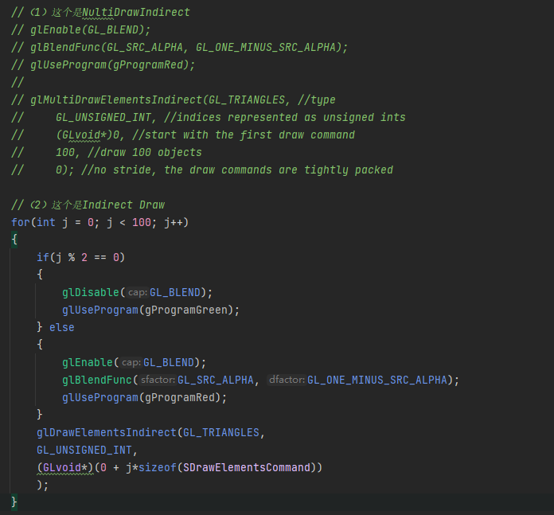

# IndirectDraw

## 材质不一样、有的是透明的

初步思考：
1、手机opengles 不能用multidraw 所以节省不了drawcall（即使MultiDraw也是一样的渲染状态）。
   单纯用indirect draw只能节省每帧去bindBuffer的时间和一次性提交VertexBuffer的时间（收益大吗？）
2、如果想节省每帧bindbuffer的时间和分开提交vertexbuffer的时间吗